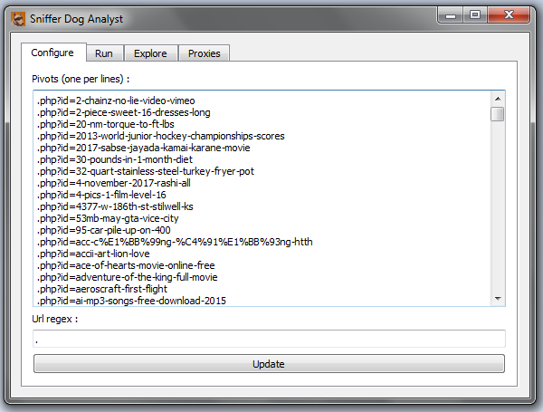
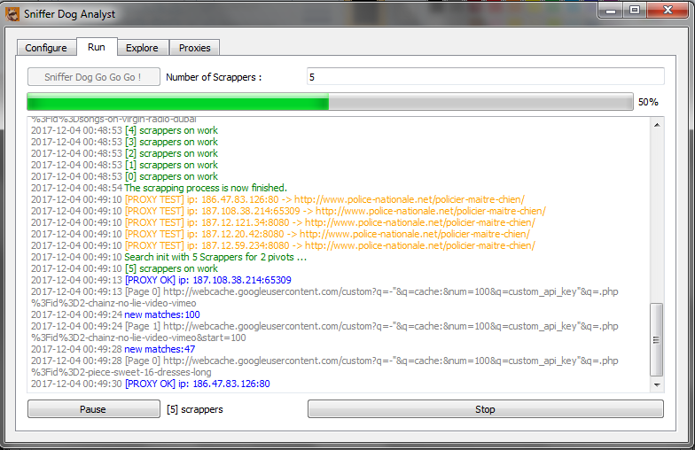
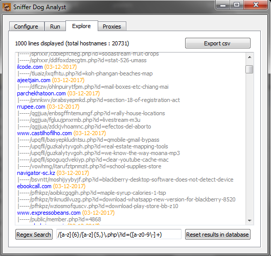
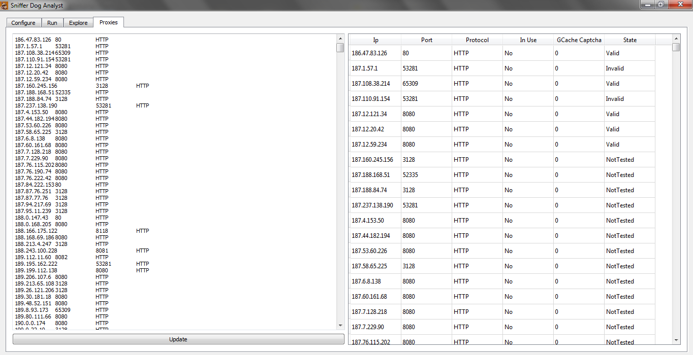

# Sniffer Dog Analyst

QT 5.9 (compilation with QT Creator tested on Windows)

Sniffer Dog Analyst will help you to find Exploit Kits or Command & Control server on the web. Give him a list of pivot to search with a regex to match in urls and sniffer dog will inspect Google Cache indexes for you. You can then export your results in csv format with a new regex after processing. A database is specialy created to store results and pivots processed.

## Screenshoots

## Formats
Update to verify if the format is well formed.

The searches use a proxy list in a tab separated format :
IP\tPORT\tHTTP\n
IP\tPORT\tHTTP\n
...

One pivot per line (It's splited with \n).
